<div align="center">

# quienteto.ca

### Modern, bilingual Secret Santa web application

_¿Quién te tocó? Organize your Secret Santa / Amigo Secreto effortlessly_

[](https://opensource.org/licenses/MIT)
[](https://quienteto.ca)
[](https://github.com/maxdenuevo/quientetoca)
[](CONTRIBUTING.md)

**🌐 [quienteto.ca](https://quienteto.ca)** - Live Production App

[Features](#-features) • [Quick Start](#-quick-start) • [Demo](#-demo) • [Documentation](#-documentation) • [Contributing](#-contributing)

</div>

---

## About

**quienteto.ca** is a free, open-source Secret Santa organizer perfect for Christmas, office parties, or any gift exchange event. Set up your group in minutes, add participants, set restrictions, and let the app handle the matching!

### Why quienteto.ca?

- **Bilingual**: Full support for English and Spanish
- **Smart Matching**: Advanced algorithm respects custom restrictions
- **Privacy First**: No one sees other people's matches
- **Mobile Friendly**: Beautiful responsive design
- **Easy Setup**: `docker-compose up` and you're done
- **100% Free**: No hidden costs, no ads, no tracking

---

## ✨ Features

### Core Features

- ✅ Create groups with 2-20 participants
- ✅ Set price range and event deadline
- ✅ Custom restrictions (who can't gift to whom)
- ✅ Automatic Secret Santa matching algorithm
- ✅ Personal wishlist for each participant
- ✅ Unique links for each participant (no login needed)
- ✅ Group dashboard to track wishlist submissions

### Optional Features

- 📧 Email notifications (configurable)
- 🌙 Dark mode support
- 📊 Price range voting visualization
- 🔗 Shareable group links

---

## How It Works

### User Roles

#### **Organizer (Admin)**

The person who creates the group and manages the Secret Santa event.

**Step 1: Create Your Group**

1. Fill in group details (name, your email)
2. Add participants (minimum 2, maximum 20)
3. Set price range and deadline
4. (Optional) Add restrictions for couples or family members
5. Click "Create Group" - the app automatically generates secret matches!

**Step 2: Share Unique Links**

- Each participant gets a unique, private link
- Copy and share via WhatsApp, Email, Slack, etc.
- No login required - just share the link!

**Step 3: Track Progress**

- View your group dashboard
- See who has added their wishlist
- Countdown to event date
- ⚠️ You won't see the secret matches (they're secret!)

#### 👥 **Participant**

Anyone who receives a unique participant link.

**What Participants See:**

- **Their secret match** - who they're buying a gift for
- **Match's wishlist** - gift ideas from their match
- **Add their own wishlist** - help others with gift ideas
- Price range and event date

**What Participants DON'T See:**

- ❌ Who is buying a gift for them (it's a secret!)
- ❌ Other people's matches
- ❌ The full group roster

### Privacy & Security

**Token-Based Security**

- Each participant gets a unique access token
- No passwords or accounts needed
- Links are private and unguessable

**Secret Matching**

- Matches are generated once and stored securely
- Even organizers can't see the secret assignments
- Row-level security protects all data

### 🎲 How Matching Works

```
Input: 4 participants + restrictions
├── Alice (can't match with Bob - they're a couple)
├── Bob (can't match with Alice)
├── Charlie
└── Diana

Algorithm generates valid matches:
├── Alice → Charlie ✅
├── Bob → Diana ✅
├── Charlie → Bob ✅
└── Diana → Alice ✅

Validation checks:
✅ No one matches with themselves
✅ All restrictions are respected
✅ Everyone gives and receives exactly once
✅ Forms a valid cycle
```

### Real-World Use Cases

**🏢 Office Secret Santa**

- 20 employees
- Budget: $10-$30
- Restrictions: Managers can't match with their direct reports
- Share links via company Slack

**👥 Friend Group**

- 6 friends, 3 couples
- Budget: $20-$100
- 3 restrictions (one per couple)
- Share links via WhatsApp group

**👨‍👩‍👧‍👦 Extended Family**

- 15 family members
- Budget: $15-$50
- 5 restrictions (nuclear families don't match within)

---

## 🚀 Quick Start

### Option 1: Docker (Recommended for Development)

The fastest way to get started locally:

```bash
# Clone the repository
git clone https://github.com/maxdenuevo/quienteto.git
cd quienteto

# Run interactive setup wizard
./setup.sh

# Or manually:
cp .env.example .env
cp frontend/.env.example frontend/.env
docker-compose up
```

**Access:**

- 🎨 Frontend: http://localhost:5173
- 🗄️ pgAdmin: http://localhost:5050 (admin@quienteto.com / admin)

### Option 2: Deploy to Cloud (Recommended for Production)

**Fastest path to production (free tier):**

```mermaid
graph LR
    A[1. Fork Repo] --> B[2. Create Supabase Project]
    B --> C[3. Run SQL Schema]
    C --> D[4. Deploy to Vercel]
    D --> E[5. Done! 🎉]

    style A fill:#6366f1
    style B fill:#3ecf8e
    style C fill:#8b5cf6
    style D fill:#0070f3
    style E fill:#10b981,color:#fff
```



**Steps:**

1. **Fork this repository**
2. **Create Supabase project** → Run `database/supabase-schema.sql`
3. **Deploy to Vercel** → Set env vars (Supabase URL + Key)
4. **Done!** 100% free hosting 🎉

---

## 📸 Demo

> **Note**: Add screenshots here once you have the UI finalized

<div align="center">

### Home Page


### Create Group


### Participant View


</div>

---

## Architecture

### System Overview


### Deployment Architecture


### Data Flow


### Tech Stack

**Frontend (Zero Bloat - 12 Dependencies)**

- React 18 + Vite
- Tailwind CSS + CVA
- lucide-react (icons)
- i18next (bilingual ES/EN)
- React Router v6
- recharts (visualizations)

**Backend Options**

- **Option A**: Supabase (PostgreSQL + Auto APIs + RLS)
- **Option B**: Docker PostgreSQL + Custom REST API

**Key Features**

- Row Level Security for privacy
- UUID-based access tokens
- Client-side matching algorithm
- Bilingual support (ES/EN)

---

## 📚 Documentation

- [Docker Setup Guide](docs/DOCKER_SETUP.md) - Local development with Docker
- [Supabase Setup Guide](docs/SUPABASE_SETUP.md) - Deploy to Supabase
- [Self-Hosting Guide](docs/SELF_HOSTING.md) - Deploy anywhere
- [Email Configuration](docs/EMAIL_SETUP.md) - Optional email notifications
- [Contributing Guidelines](CONTRIBUTING.md) - How to contribute

---

## 🛠️ Development

### Prerequisites

- Node.js 18+
- Docker & Docker Compose (for local development)
- OR Supabase account (for cloud deployment)

### Local Development Setup

#### 1. Install Dependencies

```bash
cd frontend
npm install
```

#### 2. Configure Environment

```bash
# Copy environment files
cp .env.example .env
cp frontend/.env.example frontend/.env
```

**For Docker mode** (`frontend/.env`):

```env
VITE_BACKEND_MODE=rest
VITE_API_URL=http://localhost:5000
VITE_ENABLE_EMAILS=false
```

**For Supabase mode** (`frontend/.env`):

```env
VITE_BACKEND_MODE=supabase
VITE_SUPABASE_URL=https://your-project.supabase.co
VITE_SUPABASE_ANON_KEY=your-anon-key
VITE_ENABLE_EMAILS=false
```

#### 3. Start Development

**With Docker:**

```bash
docker-compose up
```

**Frontend only:**

```bash
cd frontend
npm run dev
```

### Development Commands

```bash
# Frontend
npm run dev         # Start dev server (hot reload)
npm run build      # Production build
npm run preview    # Preview production build
npm run lint       # Run ESLint

# Docker
docker-compose up           # Start all services
docker-compose up -d        # Start in background
docker-compose logs -f      # View logs
docker-compose down         # Stop services
docker-compose down -v      # Stop and remove volumes
```

### Project Structure

```
quienteto/
├── frontend/           # React frontend
│   ├── src/
│   │   ├── components/    # UI components
│   │   ├── pages/         # Route pages
│   │   ├── hooks/         # Custom hooks
│   │   ├── context/       # Global state
│   │   ├── lib/           # Core utilities
│   │   └── i18n/          # Translations
│   └── package.json
├── database/          # Database schemas
├── docs/              # Documentation
└── docker-compose.yml # Docker setup
```

---

## 🌍 Deployment Options

### Comparison Table

| Platform               | Cost     | Setup Time | Difficulty      | Best For        |
| ---------------------- | -------- | ---------- | --------------- | --------------- |
| **Supabase + Vercel**  | $0/mo    | 45 min     | ⭐ Easy         | **Recommended** |
| **Supabase + Netlify** | $0/mo    | 45 min     | ⭐ Easy         | Alternative     |
| **Railway**            | ~$5/mo   | 1 hour     | ⭐⭐ Medium     | All-in-one      |
| **VPS (Docker)**       | $5-20/mo | 2 hours    | ⭐⭐⭐ Advanced | Full control    |

### Free Tier Breakdown


#### Option 1: Supabase + Vercel ⭐

- **Database**: Supabase (500MB, 50K users)
- **Frontend**: Vercel (100GB bandwidth)
- **Total**: **$0/month**
- **Setup**: [Guide](docs/SUPABASE_SETUP.md)

#### Option 2: Supabase + Netlify

- **Database**: Supabase (500MB, 50K users)
- **Frontend**: Netlify (100GB bandwidth)
- **Total**: **$0/month**
- **Setup**: [Guide](docs/SELF_HOSTING.md)

#### Option 3: Railway

- **All-in-one**: Database + Frontend
- **Free Credit**: $5/month
- **Total**: Free for small usage
- **Setup**: [Guide](docs/SELF_HOSTING.md#option-3-railway)

#### Option 4: VPS Self-Hosted

- **Provider**: DigitalOcean, Linode, AWS, etc.
- **Cost**: $5-20/month
- **Setup**: [Guide](docs/SELF_HOSTING.md#option-5-vps-with-docker)

### Feature Comparison

| Feature               | Supabase  | Docker VPS |
| --------------------- | --------- | ---------- |
| **Setup Time**        | 45 min    | 2 hours    |
| **Automatic Backups** | ✅        | ❌ Manual  |
| **Scaling**           | ✅ Auto   | ⚠️ Manual  |
| **SSL/HTTPS**         | ✅ Auto   | ⚠️ Manual  |
| **Cost**              | Free tier | $5-20/mo   |
| **Control**           | Medium    | Full       |

---

## 🤝 Contributing

We welcome contributions! Whether it's:

- 🐛 Bug reports and fixes
- ✨ Feature suggestions and implementations
- 📝 Documentation improvements
- 🌍 Translations to new languages

Please read our [Contributing Guidelines](CONTRIBUTING.md) before submitting PRs.

### Quick Contribution Guide

1. Fork the repository
2. Create your feature branch (`git checkout -b feature/amazing-feature`)
3. Commit your changes (`git commit -m 'Add amazing feature'`)
4. Push to the branch (`git push origin feature/amazing-feature`)
5. Open a Pull Request

---

## 📄 License

This project is licensed under the MIT License - see the [LICENSE](LICENSE) file for details.

---

<div align="center">

**Star ⭐ this repository if you find it helpful!**

Made with 🎁 by [Max Ihnen](https://github.com/maxdenuevo)

</div>
